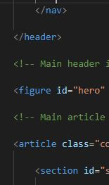

# HOMEWORK WEEK 1 - Code Refactor

## Contents
- HTML and CSS source files provided
- Stock images under creative commons license

## User Story

```
AS A marketing agency
I WANT a codebase that follows accessibility standards
SO THAT our own site is optimized for search engines
```

#### Initial code

Little to no semantic tags, no comments.

#### Final code

Changes made throughout, with both the HTML and CSS code cleaned up. 

_Snapshot of semantic tags added provided:_


##### Built with Visual Studio Code

### Authors
Orignal code sourced from © 2019 Trilogy Education Services, a 2U, Inc. brand. All Rights Reserved.

Changes made by:
_Andre Grech - 20/8/2020_
